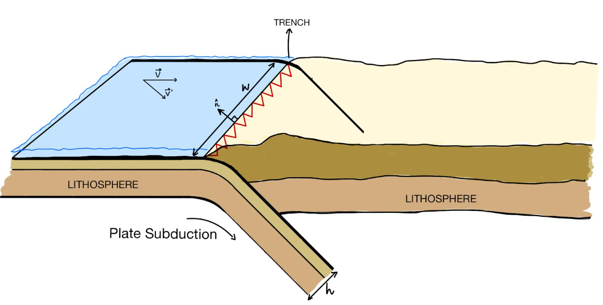

# Subduction Flux Calculation from Plate Reconstruction Models

This repository contains a code that be used to compute the subduction flux from plate reconstruction models. It is  It uses a simplified model of subduction : we consider that a slab has a constant given thickness and density of respectively $100km$ and $3g/cm^3$, and is sinking at the same velocity as the velocity of the subducting plate at the trench projected on the normal unit vector to the trench. The subduction flux is evaluated for a given subduction segment following this formula:

$F_{seg} = hw\rho \ |\vec{V}\cdot\vec{n}|$

With $h$ the thickness of the slab, $\rho$ its density, $w$ the width of subduction segment, $\vec{V}$ the absolute velocity of the plate at the midpoint of the segment and $\vec{n}$ the normal to the segment. Note that we take the absolute value of the dot product between $\vec{V}$ and $\vec{n}$ because the flux should always be positive no matter the orientation of $\vec{n}$ with respect to $\vec{V}$.

This is summerized in the following diagram.



This is a simple approach to the problem of calculating the subduction flux but it can be built-on to add complexity to the computation by for example adding an age grid to estimate the thickness of the sinking plate using a half-space cooling model.

The input should be GPlates files: .gmpl dynamic polygon file and .rot rotation file. The code is made to work with the following formmatting for the GPlates file location:
````{verbatim}
home/plate_models/key/key_rotation_model.rot
````
and
````{verbatim}
home/plate_models/key/key_dynamic_polygons.gpml
````
with key being a shorter name for a plate model, for example MA16 for Matthews et al. (2016). An example is given in the code for 4 plate models: Matthews
et al. (2016); Seton et al. (2012); Müller et al. (2016) and Torsvik et al. (2019).

This code was written and tested with the version 1.0.0 of pyGPlates but it should work with versions higher than 0.47.


This work was done by Ilyas Jaah and Jhanvee Khanna for their tutored project as part of their M2 at IPGP. It was supervised by Boris Robert and Marianne Greff-Lefftz.


References:

Kara J. Matthews, Kayla T. Maloney, Sabin Zahirovic, Simon E. Williams, Maria Seton,
and R. Dietmar Müller. Global plate boundary evolution and kinematics since the
late paleozoic. Global and Planetary Change, 146:226–250, 2016. ISSN 0921-8181.
doi:https://doi.org/10.1016/j.gloplacha.2016.10.002. URL https://www.sciencedirect.com/science/article/pii/S0921818116302417.

R. Dietmar Müller, Maria Seton, Sabin Zahirovic, Simon E. Williams, Kara J. Matthews,
Nicky M. Wright, Grace E. Shephard, Kayla T. Maloney, Nicholas Barnett-Moore, Maral Hosseinpour,
Dan J. Bower, and John Cannon. Ocean basin evolution and global-scale plate
reorganization events since pangea breakup. Annual Review of Earth and Planetary Sciences,
44(Volume 44, 2016):107–138, 2016. doi:https://doi.org/10.1146/annurev-earth-060115-
012211. URL https://www.annualreviews.org/content/journals/10.1146/annurev-earth-060115-012211.

R. Dietmar Müller, John Cannon, Xiaodong Qin, Robin J. Watson, Michael Gurnis, Simon Williams,
Tobias Pfaffelmoser, Maria Seton, Samuel H. J. Russell, and Sabin Zahirovic. Gplates: Building
a virtual earth through deep time. Geochemistry, Geophysics, Geosystems, 19(7):2243–2261,
2018. doi:https://doi.org/10.1029/2018GC007584. URL https://agupubs.onlinelibrary.wiley.com/doi/abs/10.1029/2018GC007584.

M. Seton, R.D. Müller, S. Zahirovic, C. Gaina, T. Torsvik, G. Shephard, A. Talsma, M. Gurnis,
M. Turner, S. Maus, and M. Chandler. Global continental and ocean basin reconstructions
since 200ma. Earth-Science Reviews, 113(3):212–270, 2012. ISSN 0012-8252.
doi:https://doi.org/10.1016/j.earscirev.2012.03.002. URL https://www.sciencedirect.com/science/article/pii/S0012825212000311.

Trond H. Torsvik, Bernhard Steinberger, Grace E. Shephard, Pavel V. Doubrovine, Carmen Gaina,
Mathew Domeier, Clinton P. Conrad, and William W. Sager. Pacific-panthalassic reconstructions:
Overview, errata and the way forward. Geochemistry, Geophysics, Geosystems, 20(7):3659–3689,
2019. doi:https://doi.org/10.1029/2019GC008402. URL https://agupubs.onlinelibrary.wiley.com/doi/abs/10.1029/2019GC008402.
